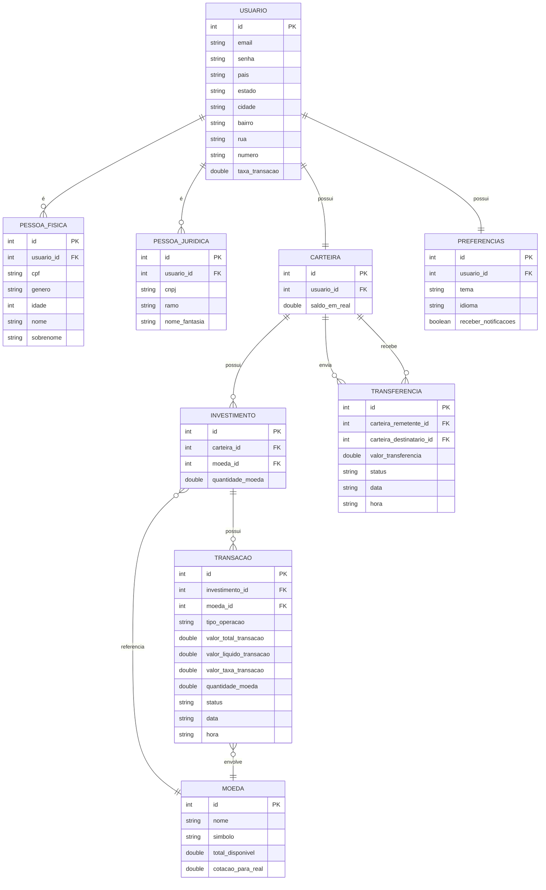

# Modelo Relacional de Dados (MER)

## Diagrama ER

## Normalização

### Primeira Forma Normal (1FN)
- Todas as tabelas possuem uma chave primária (PK)
- Todos os atributos são atômicos (não há valores multivalorados)
- Não há grupos repetitivos

### Segunda Forma Normal (2FN)
- Todas as tabelas estão na 1FN
- Todos os atributos não-chave dependem totalmente da chave primária
- Foram criadas tabelas separadas para PESSOA_FISICA e PESSOA_JURIDICA para evitar dependências parciais

### Terceira Forma Normal (3FN)
- Todas as tabelas estão na 2FN
- Não há dependências transitivas (atributos não-chave que dependem de outros atributos não-chave)
- Tabelas como INVESTIMENTO, TRANSACAO e TRANSFERENCIA foram normalizadas para evitar dependências transitivas

## Relacionamentos
- Um USUARIO pode ser uma PESSOA_FISICA ou uma PESSOA_JURIDICA (herança)
- Um USUARIO possui uma CARTEIRA
- Um USUARIO possui PREFERENCIAS
- Uma CARTEIRA pode ter vários INVESTIMENTOS
- Um INVESTIMENTO referencia uma MOEDA
- Um INVESTIMENTO pode ter várias TRANSACOES
- Uma TRANSACAO envolve uma MOEDA
- Uma CARTEIRA pode enviar ou receber várias TRANSFERENCIAS
